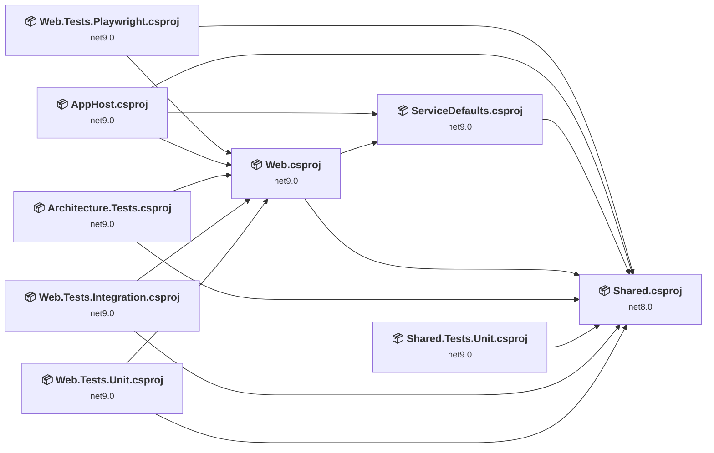
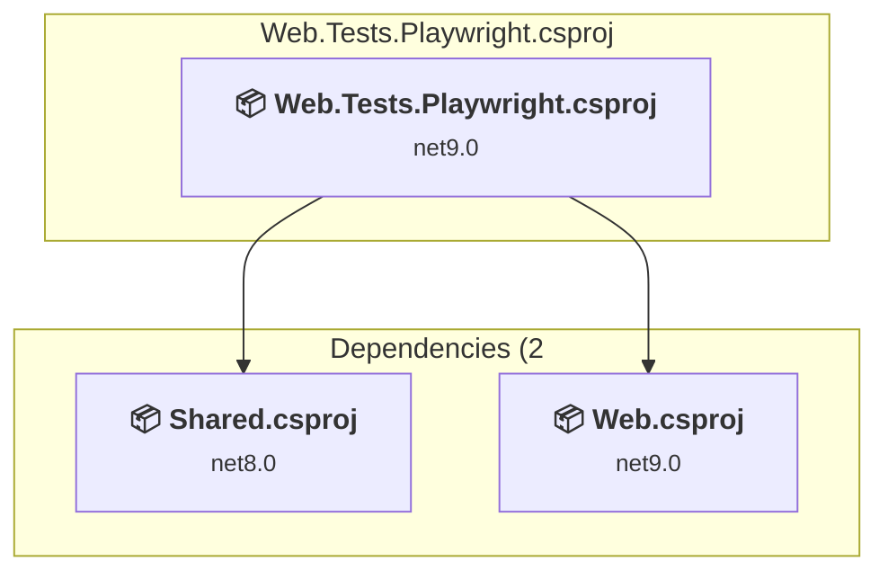
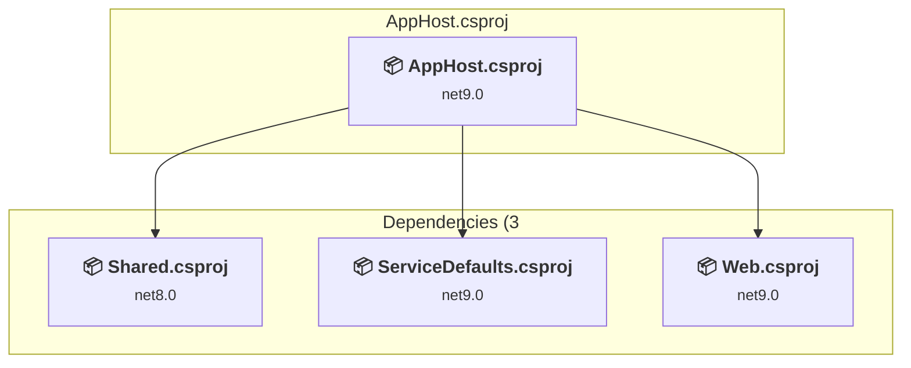
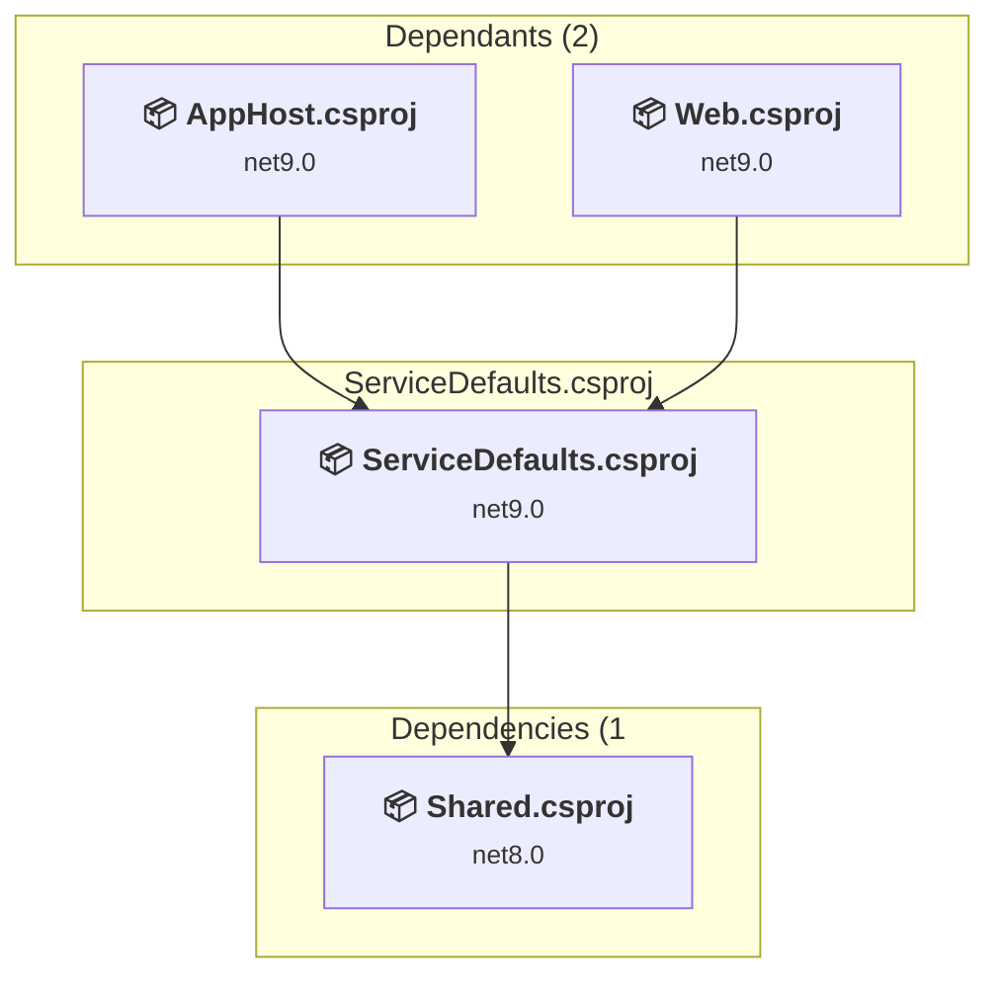
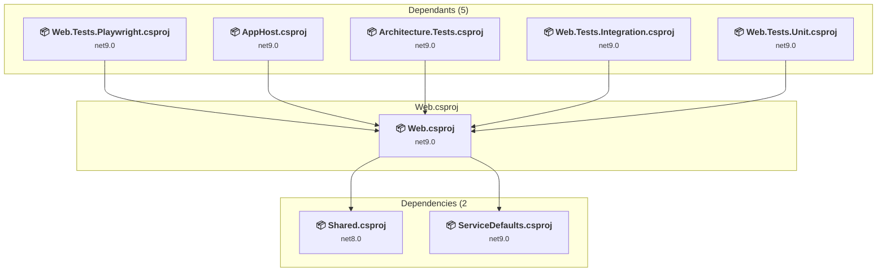
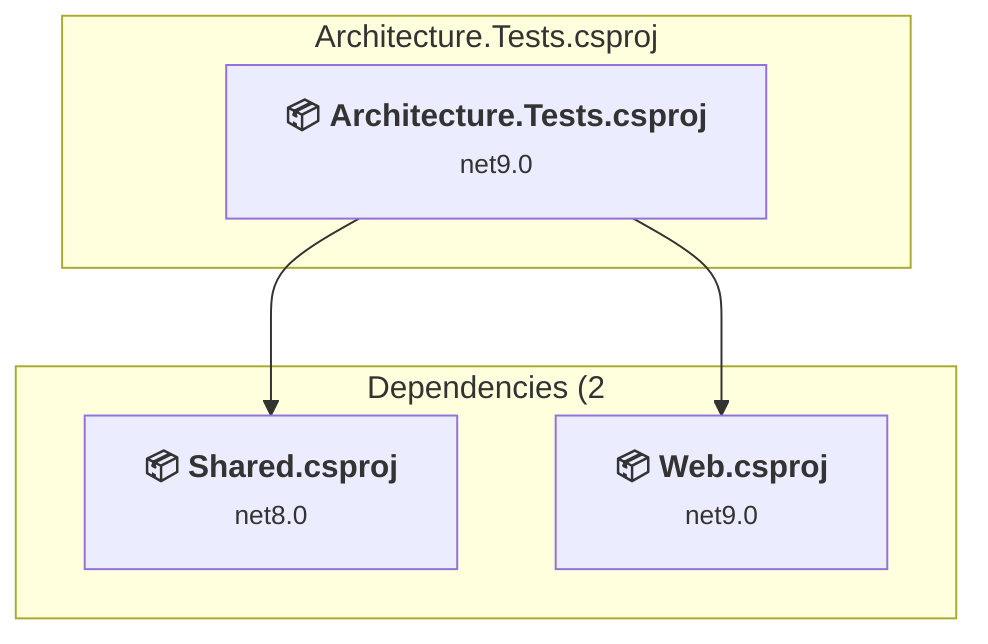
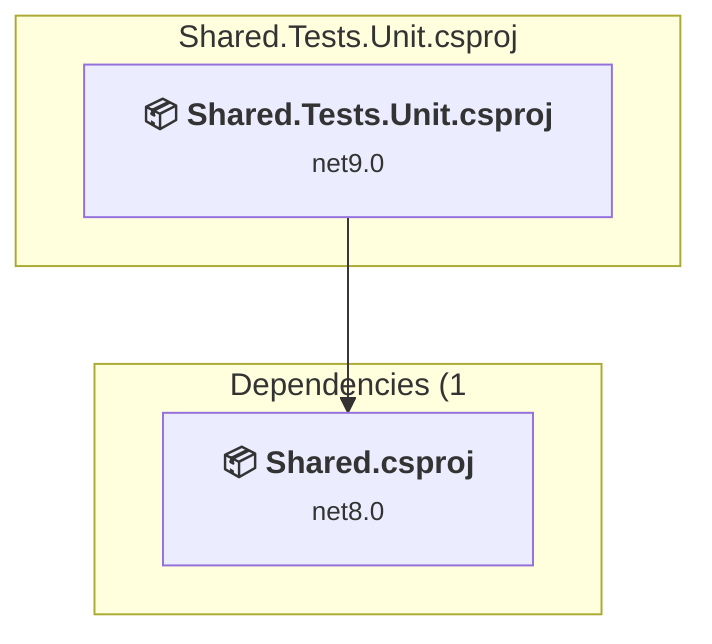
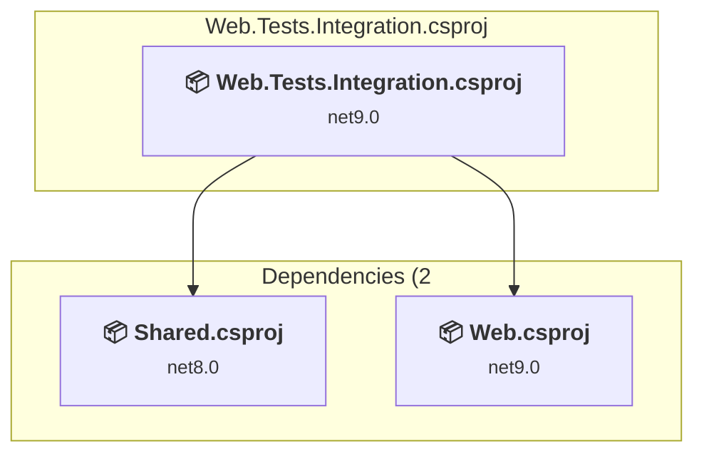
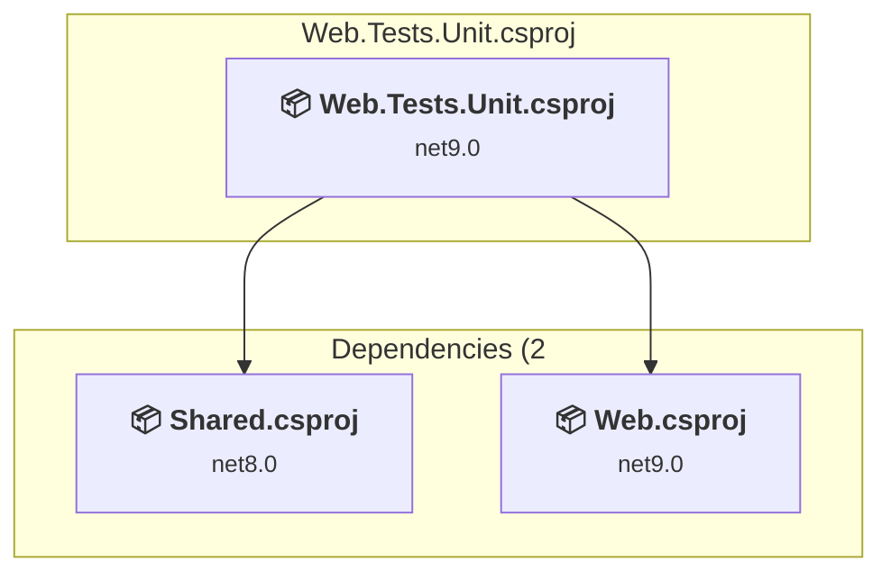

```mermaid
flowchart TB
    subgraph upstream["Dependants (8)"]
        P1["<b>📦&nbsp;Web.Tests.Playwright.csproj</b><br/><small>net9.0</small>"]
        P2["<b>📦&nbsp;AppHost.csproj</b><br/><small>net9.0</small>"]
        P3["<b>📦&nbsp;ServiceDefaults.csproj</b><br/><small>net9.0</small>"]
        P5["<b>📦&nbsp;Web.csproj</b><br/><small>net9.0</small>"]
        P6["<b>📦&nbsp;Architecture.Tests.csproj</b><br/><small>net9.0</small>"]
        P7["<b>📦&nbsp;Shared.Tests.Unit.csproj</b><br/><small>net9.0</small>"]
        P8["<b>📦&nbsp;Web.Tests.Integration.csproj</b><br/><small>net9.0</small>"]
        P9["<b>📦&nbsp;Web.Tests.Unit.csproj</b><br/><small>net9.0</small>"]
        click P1 "#e2ewebtestsplaywrightwebtestsplaywrightcsproj"
        click P2 "#srcapphostapphostcsproj"
        click P3 "#srcservicedefaultsservicedefaultscsproj"
        click P5 "#srcwebwebcsproj"
        click P6 "#testsarchitecturetestsarchitecturetestscsproj"
        click P7 "#testssharedtestsunitsharedtestsunitcsproj"
        click P8 "#testswebtestsintegrationwebtestsintegrationcsproj"
        click P9 "#testswebtestsunitwebtestsunitcsproj"
    end
    subgraph current["Shared.csproj"]
        MAIN["<b>📦&nbsp;Shared.csproj</b><br/><small>net8.0</small>"]
        click MAIN "#srcsharedsharedcsproj"
    end
    P1 --> MAIN
    P2 --> MAIN
    P3 --> MAIN
    P5 --> MAIN
    P6 --> MAIN
    P7 --> MAIN
    P8 --> MAIN
    P9 --> MAIN

```

# Projects and dependencies analysis

This document provides a comprehensive overview of the projects and their dependencies in the context of upgrading to .NET 9.0.

## Table of Contents

- [Projects Relationship Graph](#projects-relationship-graph)
- [Project Details](#project-details)

  - [e2e\Web.Tests.Playwright\Web.Tests.Playwright.csproj](#e2ewebtestsplaywrightwebtestsplaywrightcsproj)
  - [src\AppHost\AppHost.csproj](#srcapphostapphostcsproj)
  - [src\ServiceDefaults\ServiceDefaults.csproj](#srcservicedefaultsservicedefaultscsproj)
  - [src\Shared\Shared.csproj](#srcsharedsharedcsproj)
  - [src\Web\Web.csproj](#srcwebwebcsproj)
  - [tests\Architecture.Tests\Architecture.Tests.csproj](#testsarchitecturetestsarchitecturetestscsproj)
  - [tests\Shared.Tests.Unit\Shared.Tests.Unit.csproj](#testssharedtestsunitsharedtestsunitcsproj)
  - [tests\Web.Tests.Integration\Web.Tests.Integration.csproj](#testswebtestsintegrationwebtestsintegrationcsproj)
  - [tests\Web.Tests.Unit\Web.Tests.Unit.csproj](#testswebtestsunitwebtestsunitcsproj)
- [Aggregate NuGet packages details](#aggregate-nuget-packages-details)

## Projects Relationship Graph

Legend:
📦 SDK-style project
⚙️ Classic project

## Project Details

### e2e\Web.Tests.Playwright\Web.Tests.Playwright.csproj

#### Project Info

- **Current Target Framework:** net9.0
- **Proposed Target Framework:** net10.0
- **SDK-style**: True
- **Project Kind:** DotNetCoreApp
- **Dependencies**: 2
- **Dependants**: 0
- **Number of Files**: 30
- **Lines of Code**: 2624

#### Dependency Graph

Legend:
📦 SDK-style project
⚙️ Classic project

#### Project Package References

| Package | Type | Current Version | Suggested Version | Description |
| :--- | :---: | :---: | :---: | :--- |
| AspNetCore.HealthChecks.MongoDb | Explicit | 9.0.0 |  | ✅Compatible |
| Auth0.AspNetCore.Authentication | Explicit | 1.5.1 |  | ✅Compatible |
| coverlet.collector | Explicit | 6.0.4 |  | ✅Compatible |
| FluentAssertions | Explicit | 8.8.0 |  | ✅Compatible |
| Microsoft.NET.Test.Sdk | Explicit | 18.0.0 |  | ✅Compatible |
| Microsoft.Playwright | Explicit | 1.55.0 |  | ✅Compatible |
| MongoDB.Driver | Explicit | 3.5.0 |  | ✅Compatible |
| xunit.runner.visualstudio | Explicit | 3.1.5 |  | ✅Compatible |
| xunit.v3 | Explicit | 3.2.0 |  | ✅Compatible |

### src\AppHost\AppHost.csproj

#### Project Info

- **Current Target Framework:** net9.0
- **Proposed Target Framework:** net10.0
- **SDK-style**: True
- **Project Kind:** DotNetCoreApp
- **Dependencies**: 3
- **Dependants**: 0
- **Number of Files**: 4
- **Lines of Code**: 171

#### Dependency Graph

Legend:
📦 SDK-style project
⚙️ Classic project

#### Project Package References

| Package | Type | Current Version | Suggested Version | Description |
| :--- | :---: | :---: | :---: | :--- |
| Aspire.Hosting.AppHost | Explicit | 13.0.0 |  | ✅Compatible |
| Aspire.Hosting.MongoDB | Explicit | 13.0.0 |  | ✅Compatible |
| Aspire.Hosting.Redis | Explicit | 13.0.0 |  | ✅Compatible |

### src\ServiceDefaults\ServiceDefaults.csproj

#### Project Info

- **Current Target Framework:** net9.0
- **Proposed Target Framework:** net10.0
- **SDK-style**: True
- **Project Kind:** ClassLibrary
- **Dependencies**: 1
- **Dependants**: 2
- **Number of Files**: 2
- **Lines of Code**: 177

#### Dependency Graph

Legend:
📦 SDK-style project
⚙️ Classic project

#### Project Package References

| Package | Type | Current Version | Suggested Version | Description |
| :--- | :---: | :---: | :---: | :--- |
| Aspire.Hosting.AppHost | Explicit | 13.0.0 |  | ✅Compatible |
| Aspire.Hosting.MongoDB | Explicit | 13.0.0 |  | ✅Compatible |
| Aspire.Hosting.Redis | Explicit | 13.0.0 |  | ✅Compatible |
| Microsoft.Extensions.Http.Resilience | Explicit | 9.10.0 | 10.0.0 | NuGet package upgrade is recommended |
| Microsoft.Extensions.ServiceDiscovery | Explicit | 9.5.2 | 10.0.0 | NuGet package upgrade is recommended |
| OpenTelemetry.Exporter.OpenTelemetryProtocol | Explicit | 1.13.1 |  | ✅Compatible |
| OpenTelemetry.Extensions.Hosting | Explicit | 1.13.1 |  | ✅Compatible |
| OpenTelemetry.Instrumentation.AspNetCore | Explicit | 1.13.0 | 1.14.0-rc.1 | NuGet package upgrade is recommended |
| OpenTelemetry.Instrumentation.Http | Explicit | 1.13.0 | 1.14.0-rc.1 | NuGet package upgrade is recommended |
| OpenTelemetry.Instrumentation.Runtime | Explicit | 1.13.0 |  | ✅Compatible |
| StackExchange.Redis | Explicit | 2.10.1 |  | ✅Compatible |

### src\Shared\Shared.csproj

#### Project Info

- **Current Target Framework:** net8.0
- **Proposed Target Framework:** net10.0
- **SDK-style**: True
- **Project Kind:** ClassLibrary
- **Dependencies**: 0
- **Dependants**: 8
- **Number of Files**: 26
- **Lines of Code**: 1908

#### Dependency Graph

Legend:
📦 SDK-style project
⚙️ Classic project

#### Project Package References

| Package | Type | Current Version | Suggested Version | Description |
| :--- | :---: | :---: | :---: | :--- |
| Bogus | Explicit | 35.6.5 |  | ✅Compatible |
| FluentValidation | Explicit | 12.1.0 |  | ✅Compatible |
| Markdig | Explicit | 0.43.0 |  | ✅Compatible |
| MongoDB.Bson | Explicit | 3.5.0 |  | ✅Compatible |
| WaffleGenerator.Bogus | Explicit | 4.2.2 |  | ✅Compatible |

### src\Web\Web.csproj

#### Project Info

- **Current Target Framework:** net9.0
- **Proposed Target Framework:** net10.0
- **SDK-style**: True
- **Project Kind:** AspNetCore
- **Dependencies**: 2
- **Dependants**: 5
- **Number of Files**: 66
- **Lines of Code**: 1860

#### Dependency Graph

Legend:
📦 SDK-style project
⚙️ Classic project

#### Project Package References

| Package | Type | Current Version | Suggested Version | Description |
| :--- | :---: | :---: | :---: | :--- |
| AspNetCore.HealthChecks.MongoDb | Explicit | 9.0.0 |  | ✅Compatible |
| Auth0.AspNetCore.Authentication | Explicit | 1.5.1 |  | ✅Compatible |
| FluentValidation | Explicit | 12.1.0 |  | ✅Compatible |
| MongoDB.Driver | Explicit | 3.5.0 |  | ✅Compatible |
| MyMediator | Explicit | 0.0.1 |  | ✅Compatible |
| PSC.Blazor.Components.MarkdownEditor | Explicit | 8.0.8 |  | ✅Compatible |

### tests\Architecture.Tests\Architecture.Tests.csproj

#### Project Info

- **Current Target Framework:** net9.0
- **Proposed Target Framework:** net10.0
- **SDK-style**: True
- **Project Kind:** DotNetCoreApp
- **Dependencies**: 2
- **Dependants**: 0
- **Number of Files**: 9
- **Lines of Code**: 1042

#### Dependency Graph

Legend:
📦 SDK-style project
⚙️ Classic project

#### Project Package References

| Package | Type | Current Version | Suggested Version | Description |
| :--- | :---: | :---: | :---: | :--- |
| AspNetCore.HealthChecks.MongoDb | Explicit | 9.0.0 |  | ✅Compatible |
| Auth0.AspNetCore.Authentication | Explicit | 1.5.1 |  | ✅Compatible |
| coverlet.collector | Explicit | 6.0.4 |  | ✅Compatible |
| FluentAssertions | Explicit | 8.8.0 |  | ✅Compatible |
| Microsoft.NET.Test.Sdk | Explicit | 18.0.0 |  | ✅Compatible |
| MongoDB.Driver | Explicit | 3.5.0 |  | ✅Compatible |
| NetArchTest.Rules | Explicit | 1.3.2 |  | ✅Compatible |
| xunit.runner.visualstudio | Explicit | 3.1.5 |  | ✅Compatible |
| xunit.v3 | Explicit | 3.2.0 |  | ✅Compatible |

### tests\Shared.Tests.Unit\Shared.Tests.Unit.csproj

#### Project Info

- **Current Target Framework:** net9.0
- **Proposed Target Framework:** net10.0
- **SDK-style**: True
- **Project Kind:** DotNetCoreApp
- **Dependencies**: 1
- **Dependants**: 0
- **Number of Files**: 21
- **Lines of Code**: 3309

#### Dependency Graph

Legend:
📦 SDK-style project
⚙️ Classic project

#### Project Package References

| Package | Type | Current Version | Suggested Version | Description |
| :--- | :---: | :---: | :---: | :--- |
| Bogus | Explicit | 35.6.5 |  | ✅Compatible |
| coverlet.collector | Explicit | 6.0.4 |  | ✅Compatible |
| FluentAssertions | Explicit | 8.8.0 |  | ✅Compatible |
| Microsoft.NET.Test.Sdk | Explicit | 18.0.0 |  | ✅Compatible |
| xunit.runner.visualstudio | Explicit | 3.1.5 |  | ✅Compatible |
| xunit.v3 | Explicit | 3.2.0 |  | ✅Compatible |

### tests\Web.Tests.Integration\Web.Tests.Integration.csproj

#### Project Info

- **Current Target Framework:** net9.0
- **Proposed Target Framework:** net10.0
- **SDK-style**: True
- **Project Kind:** DotNetCoreApp
- **Dependencies**: 2
- **Dependants**: 0
- **Number of Files**: 18
- **Lines of Code**: 3501

#### Dependency Graph

Legend:
📦 SDK-style project
⚙️ Classic project

#### Project Package References

| Package | Type | Current Version | Suggested Version | Description |
| :--- | :---: | :---: | :---: | :--- |
| AspNetCore.HealthChecks.MongoDb | Explicit | 9.0.0 |  | ✅Compatible |
| Auth0.AspNetCore.Authentication | Explicit | 1.5.1 |  | ✅Compatible |
| coverlet.collector | Explicit | 6.0.4 |  | ✅Compatible |
| FluentAssertions | Explicit | 8.8.0 |  | ✅Compatible |
| Microsoft.AspNetCore.Mvc.Testing | Explicit | 9.0.10 | 10.0.0 | NuGet package upgrade is recommended |
| Microsoft.NET.Test.Sdk | Explicit | 18.0.0 |  | ✅Compatible |
| MongoDB.Driver | Explicit | 3.5.0 |  | ✅Compatible |
| NSubstitute | Explicit | 5.3.0 |  | ✅Compatible |
| OpenTelemetry.Extensions.Hosting | Explicit | 1.13.1 |  | ✅Compatible |
| Testcontainers | Explicit | 4.8.1 |  | ✅Compatible |
| Testcontainers.MongoDb | Explicit | 4.8.1 |  | ✅Compatible |
| xunit.runner.visualstudio | Explicit | 3.1.5 |  | ✅Compatible |
| xunit.v3 | Explicit | 3.2.0 |  | ✅Compatible |

### tests\Web.Tests.Unit\Web.Tests.Unit.csproj

#### Project Info

- **Current Target Framework:** net9.0
- **Proposed Target Framework:** net10.0
- **SDK-style**: True
- **Project Kind:** DotNetCoreApp
- **Dependencies**: 2
- **Dependants**: 0
- **Number of Files**: 26
- **Lines of Code**: 4522

#### Dependency Graph

Legend:
📦 SDK-style project
⚙️ Classic project

#### Project Package References

| Package | Type | Current Version | Suggested Version | Description |
| :--- | :---: | :---: | :---: | :--- |
| AspNetCore.HealthChecks.MongoDb | Explicit | 9.0.0 |  | ✅Compatible |
| Auth0.AspNetCore.Authentication | Explicit | 1.5.1 |  | ✅Compatible |
| bunit | Explicit | 1.40.0 |  | ✅Compatible |
| coverlet.collector | Explicit | 6.0.4 |  | ✅Compatible |
| FluentAssertions | Explicit | 8.8.0 |  | ✅Compatible |
| Microsoft.NET.Test.Sdk | Explicit | 18.0.0 |  | ✅Compatible |
| MongoDB.Driver | Explicit | 3.5.0 |  | ✅Compatible |
| NSubstitute | Explicit | 5.3.0 |  | ✅Compatible |
| NSubstitute.Analyzers.CSharp | Explicit | 1.0.17 |  | ✅Compatible |
| xunit | Explicit | 2.9.3 |  | ✅Compatible |
| xunit.runner.visualstudio | Explicit | 3.1.5 |  | ✅Compatible |

## Aggregate NuGet packages details

| Package | Current Version | Suggested Version | Projects | Description |
| :--- | :---: | :---: | :--- | :--- |
| Aspire.Hosting.AppHost | 13.0.0 |  | [AppHost.csproj](#apphostcsproj) [ServiceDefaults.csproj](#servicedefaultscsproj) | ✅Compatible |
| Aspire.Hosting.MongoDB | 13.0.0 |  | [AppHost.csproj](#apphostcsproj) [ServiceDefaults.csproj](#servicedefaultscsproj) | ✅Compatible |
| Aspire.Hosting.Redis | 13.0.0 |  | [AppHost.csproj](#apphostcsproj) [ServiceDefaults.csproj](#servicedefaultscsproj) | ✅Compatible |
| AspNetCore.HealthChecks.MongoDb | 9.0.0 |  | [Web.Tests.Playwright.csproj](#webtestsplaywrightcsproj) [Web.csproj](#webcsproj) [Architecture.Tests.csproj](#architecturetestscsproj) [Web.Tests.Integration.csproj](#webtestsintegrationcsproj) [Web.Tests.Unit.csproj](#webtestsunitcsproj) | ✅Compatible |
| Auth0.AspNetCore.Authentication | 1.5.1 |  | [Web.Tests.Playwright.csproj](#webtestsplaywrightcsproj) [Web.csproj](#webcsproj) [Architecture.Tests.csproj](#architecturetestscsproj) [Web.Tests.Integration.csproj](#webtestsintegrationcsproj) [Web.Tests.Unit.csproj](#webtestsunitcsproj) | ✅Compatible |
| Bogus | 35.6.5 |  | [Shared.csproj](#sharedcsproj) [Shared.Tests.Unit.csproj](#sharedtestsunitcsproj) | ✅Compatible |
| bunit | 1.40.0 |  | [Web.Tests.Unit.csproj](#webtestsunitcsproj) | ✅Compatible |
| coverlet.collector | 6.0.4 |  | [Web.Tests.Playwright.csproj](#webtestsplaywrightcsproj) [Architecture.Tests.csproj](#architecturetestscsproj) [Shared.Tests.Unit.csproj](#sharedtestsunitcsproj) [Web.Tests.Integration.csproj](#webtestsintegrationcsproj) [Web.Tests.Unit.csproj](#webtestsunitcsproj) | ✅Compatible |
| FluentAssertions | 8.8.0 |  | [Web.Tests.Playwright.csproj](#webtestsplaywrightcsproj) [Architecture.Tests.csproj](#architecturetestscsproj) [Shared.Tests.Unit.csproj](#sharedtestsunitcsproj) [Web.Tests.Integration.csproj](#webtestsintegrationcsproj) [Web.Tests.Unit.csproj](#webtestsunitcsproj) | ✅Compatible |
| FluentValidation | 12.1.0 |  | [Shared.csproj](#sharedcsproj) [Web.csproj](#webcsproj) | ✅Compatible |
| Markdig | 0.43.0 |  | [Shared.csproj](#sharedcsproj) | ✅Compatible |
| Microsoft.AspNetCore.Mvc.Testing | 9.0.10 | 10.0.0 | [Web.Tests.Integration.csproj](#webtestsintegrationcsproj) | NuGet package upgrade is recommended |
| Microsoft.Extensions.Http.Resilience | 9.10.0 | 10.0.0 | [ServiceDefaults.csproj](#servicedefaultscsproj) | NuGet package upgrade is recommended |
| Microsoft.Extensions.ServiceDiscovery | 9.5.2 | 10.0.0 | [ServiceDefaults.csproj](#servicedefaultscsproj) | NuGet package upgrade is recommended |
| Microsoft.NET.Test.Sdk | 18.0.0 |  | [Web.Tests.Playwright.csproj](#webtestsplaywrightcsproj) [Architecture.Tests.csproj](#architecturetestscsproj) [Shared.Tests.Unit.csproj](#sharedtestsunitcsproj) [Web.Tests.Integration.csproj](#webtestsintegrationcsproj) [Web.Tests.Unit.csproj](#webtestsunitcsproj) | ✅Compatible |
| Microsoft.Playwright | 1.55.0 |  | [Web.Tests.Playwright.csproj](#webtestsplaywrightcsproj) | ✅Compatible |
| MongoDB.Bson | 3.5.0 |  | [Shared.csproj](#sharedcsproj) | ✅Compatible |
| MongoDB.Driver | 3.5.0 |  | [Web.Tests.Playwright.csproj](#webtestsplaywrightcsproj) [Web.csproj](#webcsproj) [Architecture.Tests.csproj](#architecturetestscsproj) [Web.Tests.Integration.csproj](#webtestsintegrationcsproj) [Web.Tests.Unit.csproj](#webtestsunitcsproj) | ✅Compatible |
| MyMediator | 0.0.1 |  | [Web.csproj](#webcsproj) | ✅Compatible |
| NetArchTest.Rules | 1.3.2 |  | [Architecture.Tests.csproj](#architecturetestscsproj) | ✅Compatible |
| NSubstitute | 5.3.0 |  | [Web.Tests.Integration.csproj](#webtestsintegrationcsproj) [Web.Tests.Unit.csproj](#webtestsunitcsproj) | ✅Compatible |
| NSubstitute.Analyzers.CSharp | 1.0.17 |  | [Web.Tests.Unit.csproj](#webtestsunitcsproj) | ✅Compatible |
| OpenTelemetry.Exporter.OpenTelemetryProtocol | 1.13.1 |  | [ServiceDefaults.csproj](#servicedefaultscsproj) | ✅Compatible |
| OpenTelemetry.Extensions.Hosting | 1.13.1 |  | [ServiceDefaults.csproj](#servicedefaultscsproj) [Web.Tests.Integration.csproj](#webtestsintegrationcsproj) | ✅Compatible |
| OpenTelemetry.Instrumentation.AspNetCore | 1.13.0 | 1.14.0-rc.1 | [ServiceDefaults.csproj](#servicedefaultscsproj) | NuGet package upgrade is recommended |
| OpenTelemetry.Instrumentation.Http | 1.13.0 | 1.14.0-rc.1 | [ServiceDefaults.csproj](#servicedefaultscsproj) | NuGet package upgrade is recommended |
| OpenTelemetry.Instrumentation.Runtime | 1.13.0 |  | [ServiceDefaults.csproj](#servicedefaultscsproj) | ✅Compatible |
| PSC.Blazor.Components.MarkdownEditor | 8.0.8 |  | [Web.csproj](#webcsproj) | ✅Compatible |
| StackExchange.Redis | 2.10.1 |  | [ServiceDefaults.csproj](#servicedefaultscsproj) | ✅Compatible |
| Testcontainers | 4.8.1 |  | [Web.Tests.Integration.csproj](#webtestsintegrationcsproj) | ✅Compatible |
| Testcontainers.MongoDb | 4.8.1 |  | [Web.Tests.Integration.csproj](#webtestsintegrationcsproj) | ✅Compatible |
| WaffleGenerator.Bogus | 4.2.2 |  | [Shared.csproj](#sharedcsproj) | ✅Compatible |
| xunit | 2.9.3 |  | [Web.Tests.Unit.csproj](#webtestsunitcsproj) | ✅Compatible |
| xunit.runner.visualstudio | 3.1.5 |  | [Web.Tests.Playwright.csproj](#webtestsplaywrightcsproj) [Architecture.Tests.csproj](#architecturetestscsproj) [Shared.Tests.Unit.csproj](#sharedtestsunitcsproj) [Web.Tests.Integration.csproj](#webtestsintegrationcsproj) [Web.Tests.Unit.csproj](#webtestsunitcsproj) | ✅Compatible |
| xunit.v3 | 3.2.0 |  | [Web.Tests.Playwright.csproj](#webtestsplaywrightcsproj) [Architecture.Tests.csproj](#architecturetestscsproj) [Shared.Tests.Unit.csproj](#sharedtestsunitcsproj) [Web.Tests.Integration.csproj](#webtestsintegrationcsproj) | ✅Compatible |

